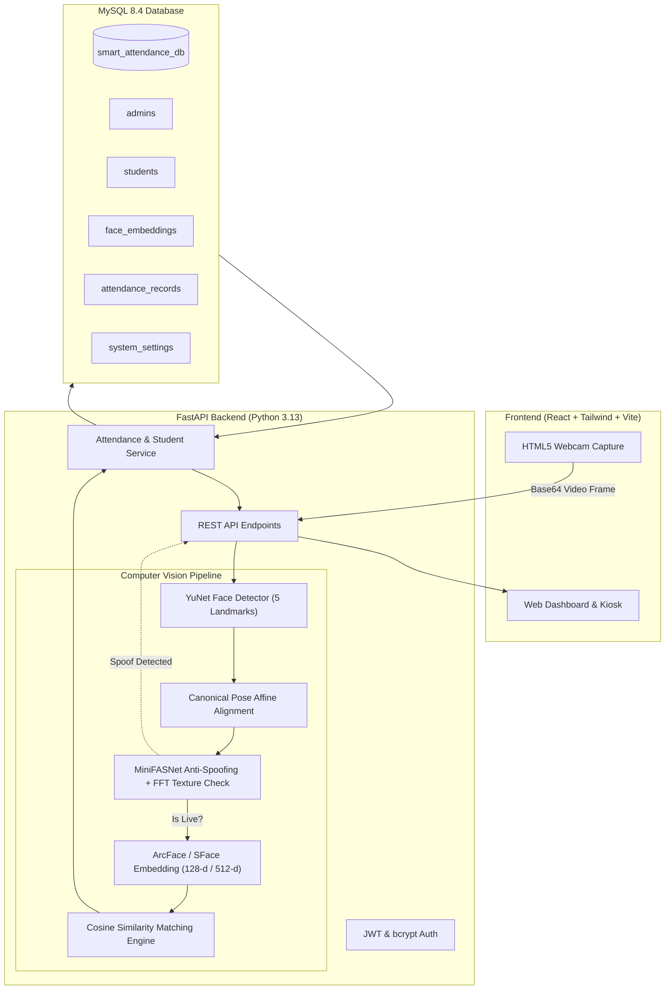

# Face Recognition & Smart Attendance System with Real Anti-Spoofing

[](https://www.python.org/)
[](https://fastapi.tiangolo.com/)
[](https://react.dev/)
[](https://tailwindcss.com/)
[](https://www.mysql.com/)
[](https://opencv.org/)
[](https://onnxruntime.ai/)

A production-grade, enterprise-ready **Biometric Face Recognition and Smart Attendance Management System** built for a College Final Year CSE Project. The system features real deep learning facial recognition, genuine presentation attack detection (anti-spoofing) to reject printed photos and phone screen replays, and real-time attendance analytics stored in a normalized MySQL 8.4 database.

---

## 🌟 Key Features

1. **Secure Admin Authentication**:
   - JWT (JSON Web Token) authentication with bcrypt password hashing.
   - Protected endpoints and role-based session management.
   - Default master credentials: `admin` / `Admin@123`.

2. **Computer Vision & Face Biometrics**:
   - **Face Detection & Landmark Alignment**: OpenCV YuNet ONNX detector with 5-point landmark affine transformation.
   - **Feature Extraction**: Deep ArcFace (SFace) neural network generating 128-d/512-d L2-normalized feature embeddings.
   - **Biometric Matching**: Real-time Cosine Similarity search against registered student vectors.

3. **Genuine Anti-Spoofing & Liveness Shield**:
   - **Deep Learning Model**: MiniFASNet (Silent-Face-Anti-Spoofing) multi-scale ONNX classifier.
   - **Texture & Moire Analysis**: 2D Fast Fourier Transform (FFT) high-frequency analysis.
   - Rejects 2D printed photographs, phone/tablet screen replays, and paper cutouts.

4. **Smart Attendance Automation**:
   - Automated duplicate prevention (prevents multiple attendance marks for the same student on the same day).
   - Biometric audit trail: stores timestamp, match score, and liveness confidence.
   - One-click CSV spreadsheet export.

5. **Modern React Admin Dashboard**:
   - Interactive attendance trend charts powered by **Recharts**.
   - Department-wise attendance breakdown and enrollment statistics.
   - Multi-step student registration with live webcam preview and quality feedback.
   - Live Attendance Kiosk with real-time audio chimes and visual verification banners.

---

## 📐 System Architecture



---

## 🗄️ Database Design (`smart_attendance_db`)

The database is fully normalized in MySQL 8.4:

| Table | Description | Key Fields |
| :--- | :--- | :--- |
| `admins` | Master administrator accounts | `id`, `username`, `email`, `hashed_password`, `role` |
| `students` | Enrolled student profiles | `id`, `usn` (Unique), `full_name`, `email`, `department`, `year`, `section` |
| `face_embeddings` | 128/512-dim normalized biometric vectors | `id`, `student_id` (FK), `embedding_json`, `quality_score`, `model_name` |
| `attendance_records` | Attendance logs with verification metrics | `id`, `student_id` (FK), `attendance_date`, `attendance_time`, `status`, `confidence_score`, `liveness_score` |
| `system_settings` | Dynamic threshold overrides | `id`, `key_name`, `key_value`, `description` |

A clean SQL initialization script is provided at `database/schema.sql`.

---

## 🚀 Installation & Running Guide

### Prerequisites
- **Operating System**: Windows 11 / 10, Linux, or macOS
- **Python**: 3.13+ (64-bit)
- **Node.js**: v20+ / v24+
- **MySQL Server**: 8.0+ / 8.4+ (running on port 3306)

---

### Step 1: Clone or Open the Repository
```bash
cd FaceRecognitionSystem
```

---

### Step 2: Backend Setup (FastAPI + Python 3.13)

1. Navigate to the `backend` directory:
   ```bash
   cd backend
   ```

2. Install Python dependencies:
   ```bash
   py -3.13 -m pip install -r requirements.txt
   ```

3. Configure environment variables in `.env`:
   ```ini
   DB_HOST=localhost
   DB_PORT=3306
   DB_USER=root
   DB_PASSWORD=your_mysql_password
   DB_NAME=smart_attendance_db
   JWT_SECRET=your_secret_key_here
   FACE_SIMILARITY_THRESHOLD=0.60
   LIVENESS_THRESHOLD=0.85
   ATTENDANCE_COOLDOWN_MINUTES=60
   ```

4. Initialize the MySQL Database & seed the default admin:
   ```bash
   py -3.13 -m app.database.init_db
   ```

5. Start the FastAPI backend server:
   ```bash
   py -3.13 -m uvicorn app.main:app --host 127.0.0.1 --port 8000 --reload
   ```
   - API Root: `http://127.0.0.1:8000/`
   - Interactive Swagger Docs: `http://127.0.0.1:8000/docs`

---

### Step 3: Frontend Setup (React + Vite + Tailwind)

1. In a new terminal, navigate to the `frontend` directory:
   ```bash
   cd frontend
   ```

2. Install npm packages:
   ```bash
   npm install
   ```

3. Start the Vite development server:
   ```bash
   npm run dev
   ```
   - Open browser: `http://127.0.0.1:5173/`

---

## 🧪 Testing Procedure

### 1. Automated Unit & Integration Tests
Run pytest to verify authentication, database CRUD, face validation, and CSV export:
```bash
cd backend
py -3.13 -m pytest tests/ -v
```

### 2. Manual Live System Verification
1. **Login**: Navigate to `http://127.0.0.1:5173/login` and log in with `admin` / `Admin@123`.
2. **Register a Student**:
   - Go to **Register Student** (`/students/register`).
   - Fill in Student Details (e.g. USN: `1RV21CS001`, Name: `Your Name`, Department: `Computer Science & Engineering`).
   - Click **Proceed to Face Capture**.
   - Position your face inside the alignment frame and click **Capture Face**.
   - Verify that your face embedding is saved in MySQL.
3. **Test Face Recognition & Attendance**:
   - Go to **Live Attendance** (`/recognition`).
   - Click **Start Auto-Scan Loop** or click **Capture Face**.
   - The system will detect your face, verify liveness, identify your student profile, and mark attendance as `PRESENT`.
4. **Test Real Anti-Spoofing (Attack Rejection)**:
   - Hold up a printed photograph of your face or show your photo on a mobile phone screen in front of the webcam.
   - The system will detect the presentation attack, display a red `SPOOF ATTACK REJECTED` alert, and refuse to mark attendance.
5. **View Attendance History & Export**:
   - Go to **Attendance Records** (`/attendance`).
   - Check the logged attendance with match score and liveness audit score.
   - Click **Export to CSV Spreadsheet** to download the attendance report.

---

## 🎓 Viva & Project Defense Guide for CSE Students

### Q1: How does Face Recognition work in this system?
> **Answer**: We employ a deep metric learning architecture using the **ArcFace / SFace** deep convolutional neural network. The detector (YuNet) locates 5 facial landmarks (eyes, nose, mouth corners) and applies an affine transformation to normalize the face to a canonical $112 \times 112$ pose. The feature extractor maps the face image into a compact 128/512-dimensional Euclidean hypersphere. We then compute the **Cosine Similarity** ($\cos \theta = \frac{\mathbf{u} \cdot \mathbf{v}}{\|\mathbf{u}\| \|\mathbf{v}\|}$) between the query face and registered embeddings in MySQL.

### Q2: Why is blink detection alone insufficient for anti-spoofing?
> **Answer**: Simple blink detection can be bypassed using looped video replays or deepfake animations on a tablet. Our system implements a dual-layer approach:
> 1. **MiniFASNet Deep Neural Network**: Analyzes multi-scale facial depth, subtle specular skin reflections, and micro-textures.
> 2. **2D Fast Fourier Transform (FFT)**: Inspects high-frequency spectral distributions to detect digital screen moiré patterns and dot-matrix paper printing artifacts.

### Q3: How is duplicate attendance prevented?
> **Answer**: At the database level, a `UniqueConstraint(student_id, attendance_date)` ensures atomic deduplication. At the application service level, the system checks today's date and a configurable attendance cooldown window (default 60 minutes).

---

## 📄 License
Developed for Academic Final Year Computer Science & Engineering Project demonstration.
